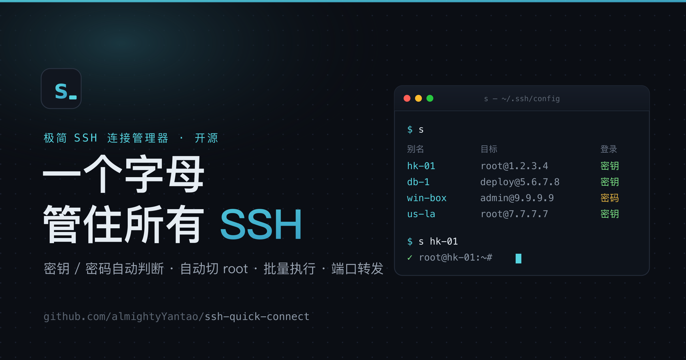

# s — 一个字母管住所有 SSH



> A tiny SSH connection manager built on top of the standard `~/.ssh/config`.
> One short alias to connect anything — keys or passwords, with auto-`sudo -i`, batch exec, port-forwarding and fzf picker.

服务器从 3 台变成 30 台后，`ssh` 就开始难受了：IP 记不住、密钥和密码混着来、有的机器登进去还得手动 `sudo -i`。

`s` 是一个不到 600 行的 bash 脚本，把日常 SSH 运维压缩成一个字母开头的命令。**底层永远是标准 `~/.ssh/config`，绝不发明新格式**——所以 `s <别名>` 能连，原生 `ssh <别名>`、`scp`、`rsync`、VS Code Remote 也全都认这些别名。

```
$ s                          # 打开交互菜单：分组树 + 模糊搜索，回车即连
$ s ls                       # 或直接按分组列出全部主机
▊ 香港
    hk-01               root@1.2.3.4             22     密钥   主力节点
▊ 业务
    db-1                deploy@5.6.7.8           2222   密钥   业务库
    win-box             admin@9.9.9.9            22     密码   ⇒root  跳板机

$ s hk-01                    # 直接连，密钥/密码自动判断
$ s ping                     # 全部主机一眼看在线/离线
$ s run 'db-*' 'df -h /'     # 一批机器上跑同一条命令
$ s export ~/s-backup.enc    # 打成加密备份，换电脑一条 s import 全恢复
```

## 特性

- **一个别名连一切**：`s <别名>` 自动判断密钥 / 密码登录
- **交互菜单**：裸敲 `s` 打开 fzf 菜单——按分组列出，打字模糊搜索（别名/IP/描述/分组都能搜），回车即连
- **分组管理**：`s group <别名> <组名>` 把机器归类，列表和菜单都按分组展示；支持 `s group 'lbc-*' LBC` 通配符 / 逗号批量归组
- **加密备份 / 迁移**：`s export` 把所有主机 + Keychain 里的密码打成一个 `openssl` 加密包，换电脑 `s import` 一条命令全恢复（密码也一起）
- **密码不落明文**：密码存进 macOS Keychain，配置文件里只留一行标记
- **登录后自动切 root**：`s root <别名> on`，密码机自动复用登录密码过 `sudo`
- **文件传输**：`s put` / `s get`，密码机自动走 `sshpass`
- **批量执行**：`s run '<通配符>' '<命令>'`，适合集群 / 多地节点
- **端口转发**：`s fwd <别名> 8123`，把远端只监听本机的服务拉到本地
- **连通性检查**：`s ping`，支持通配符筛选
- **中文对齐、Tab 补全**：列表按显示宽度对齐；zsh 补全实时读 config
- **纯标准 config**：所有别名就是 `~/.ssh/config` 条目，其它工具通用

## 依赖

| 依赖 | 用途 | 必需 |
|---|---|---|
| `bash` / `awk` / `ssh` | 核心 | ✅ |
| macOS `security`（Keychain） | 存密码 | 仅密码登录需要（**macOS only**） |
| [`sshpass`](https://formulae.brew.sh/formula/sshpass) | 密码登录喂密码 | 仅密码登录需要 |
| `fzf` | `s pick` 模糊选机 | 可选 |
| `nc` | `s ping` 连通性检查 | 可选 |

```bash
brew install sshpass fzf   # 按需
```

> ⚠️ 密码存储用的是 macOS 钥匙串（`security` 命令），**密码登录功能仅限 macOS**。密钥登录、批量执行、端口转发等在 Linux 上同样可用。

## 安装

```bash
git clone https://github.com/almightyYantao/ssh-quick-connect.git
cd ssh-quick-connect
./install.sh
```

`install.sh` 会把 `s` 装到 `~/.local/bin`（确保它在 `PATH` 里），并把 zsh 补全装到合适的目录。之后开个新终端或 `exec zsh` 即可。

手动安装也很简单：

```bash
cp s ~/.local/bin/s && chmod +x ~/.local/bin/s
cp completions/_s ~/.oh-my-zsh/completions/_s   # 或任意在 $fpath 里的目录
```

## 用法

```
s                         交互菜单：分组树 + 模糊搜索，回车即连
s <别名>                  连接（自动判断密钥/密码登录）
s ls                      按分组列出所有主机
s add <别名> <user@host> [-p PORT] [-i KEYFILE] [--pass] [-d "描述"] [-g 组] [--root]
s add                     交互式添加
s rm <别名>               删除（含 Keychain 里的密码）
s set <别名/通配符> host|user|port|group|desc <值>   改字段（支持 lbc-* 批量）
s desc <别名/通配符> [描述…]   设置/修改描述（支持批量）
s group <别名/通配符> [组名]   设置/修改分组（留空移出；支持 lbc-* 批量）
s root <别名> [on|off]    开/关"登录后自动 sudo -i 切 root"
s passwd <别名>           修改密码登录主机在 Keychain 里的密码
s cp <别名>               把公钥拷过去，升级为免密
s put [-r] <本地…> <别名:路径>      上传（密码机自动走 sshpass）
s get [-r] <别名:路径> <本地>       下载
s ping [别名/通配符…]     连通性检查；不带参数=全部
s pick                    fzf 模糊选机并连接（单层平铺）
s fwd <别名> <spec…>      端口转发，如 s fwd db-1 8123
s run <选择器> <命令…>    批量执行，如 s run 'db-*' 'uptime'
s export [文件]           打包加密备份（默认 ~/s-backup.enc）
s import <文件>           从加密备份恢复（已存在别名跳过）
s edit                    用 $EDITOR 打开 ~/.ssh/config
```

### 分组与批量

```bash
s group hk-01 香港               # 单台归组
s set 'lbc-*' group LBC          # 通配符批量归组（s group 也行）
s group 'db-1,db-2' 业务          # 逗号选多个
s set 'lbc-*' port 2222          # host/user/port 也能批量改
```

### 加密备份与迁移

```bash
s export ~/s-backup.enc          # 设个口令，打成 aes-256 加密包（含 Keychain 密码）
# —— 换到新电脑 ——
s import ~/s-backup.enc          # 输口令解密，主机块 merge 进 config、密码写回 Keychain
```

> 备份文件 + 口令 = 你全部服务器的凭据，务必妥善保管、口令记牢（解不开没有找回）。

### 添加主机

```bash
s add hk-01 root@1.2.3.4 -i ~/.ssh/id_ed25519 -d "香港 主力节点"
s add win-box admin@9.9.9.9 --pass -d "跳板机"     # --pass 会提示输入密码
s add                                               # 交互式，逐项询问
```

### 批量执行

```bash
s run 'db-*' 'df -h /'            # 通配符选一组
s run 'db-1,win-box' 'uptime'     # 逗号分隔多个选择器
```

### 端口转发

```bash
s fwd db-1 8123                    # 本地:8123 → 远端 localhost:8123
s fwd jump 5432:10.0.0.100:5432   # 借 jump 当跳板，连它内网里的库
```

> `本地:远端主机:远端口` 中间那个地址是**从服务器角度**解析的：`localhost` = SSH 连上的那台服务器自己；写内网 IP 则让它当跳板去连内网里的第三台机器。

## 它是怎么存数据的

一切都在 `~/.ssh/config`。`s` 自己需要、而 `ssh` 又不认识的元数据，用注释行存在同一个 Host 块里（`ssh` 忽略 `#` 开头的行）：

```
Host win-box
  #s-group  跳板          # 分组
  #s-desc   跳板机        # 描述
  #s-auth   password      # 标记为密码登录（密码在 Keychain，不在这里）
  #s-root   yes           # 登录后自动 sudo -i
  HostName  9.9.9.9
  User      admin
```

一份配置，两套解读：原生 `ssh` 只看标准字段，`s` 多读几行注释。密码本身通过 `security add-generic-password` 存进 Keychain（service = `ssh-s-tool`），永不写入明文文件。`s export` 备份时，正是把这些 Host 块和 Keychain 里对应的密码一起打包加密——所以换电脑 `s import` 能连密码一并恢复。

## License

MIT
